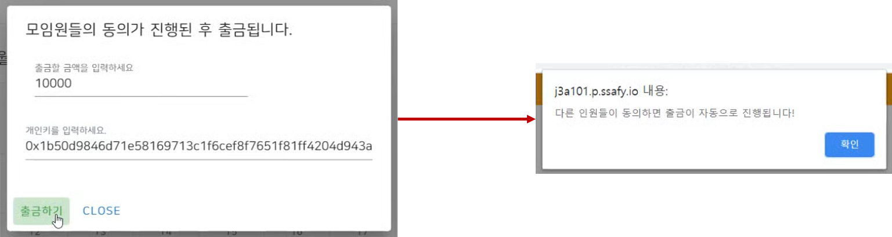

# **TraBlock** (`Travel` + `Blockchain`)
 > 이더리움을 활용하여 투명하게 모임용 계좌를 생성하고 관리할 수 있는 DApp 서비스

  

 

 

### 기술 스택

    <h3>frontend</h3>
    &nbsp;&nbsp;
    &nbsp;&nbsp;
     
    <h3>backend</h3>
	&nbsp;&nbsp;
    &nbsp;&nbsp;
    &nbsp;&nbsp;
    &nbsp;&nbsp;
    &nbsp;&nbsp;
     
    <h3>Ethereum Network</h3>
    &nbsp;&nbsp;
    &nbsp;&nbsp;
    &nbsp;&nbsp;
     
    <h3>Deploy Environment</h3>
    &nbsp;&nbsp;
    &nbsp;&nbsp;
    &nbsp;&nbsp;

  

### 주요 기능

 - **메인 페이지**

   

    

 - **모임 생성**

    - 정보 입력

      

    - 모임 생성

      > 모임 등록 시 **모임주의 개인키** 입력 => 모임주 계정으로 모임 **스마트 컨트랙트** 배포를 위한 트랜잭션 발생시켜 CA(Contract Account) 생성

      

       

- **모임 상세 페이지**

  - 상세 페이지

    

  - 납부하기

    > 모임원의 EOA(External Owned Account) => 모임의 CA(Contract Account) 로 송금 트랜잭션 발생

    

  - 출금하기

    > 모임원 모두가 출금 가능하며, 출금신청 시 모든 모임원의 동의가 필요
    >
    > _**다중서명(Multi-signature) 기능 구현 실패 => 데이터베이스에 출금 동의 테이블을 만들어 임시로 기능을 구현해 놓은 상태**_

    

     

- **지갑 관리**

  - 충전하기

    > 시스템에서 임의로 **5이더** 씩 충전 => `가나슈(Ganache)`로 얻은 충전되어 있는 계정 사용
    >
    > **TBC** => 테스트넷에 발행해 둔 ERC 20 토큰으로, 이더 충전 후 송금 시에 자동 환전됨(`ETH` -> `TBC`) 

    

  

### 결과

- `Ropsten` 테스트넷 환경에서 구현
- 모임 스마트 컨트랙트 작성
  - **모임원 등록**, **송금**, **출금** 기능 구현 성공
  - **다중서명**, **미납 2회 누적 시 퇴출** 기능 구현 실패 